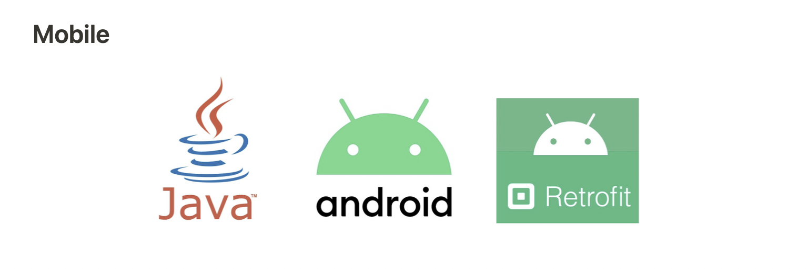
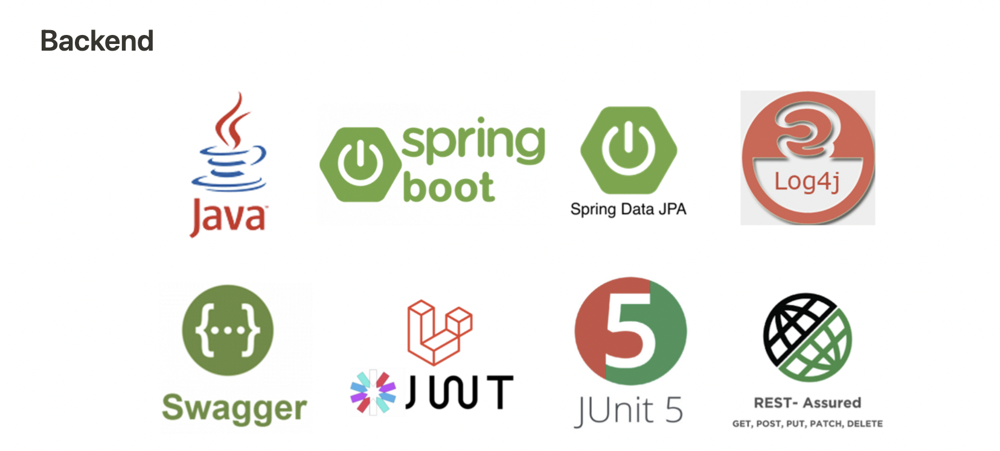
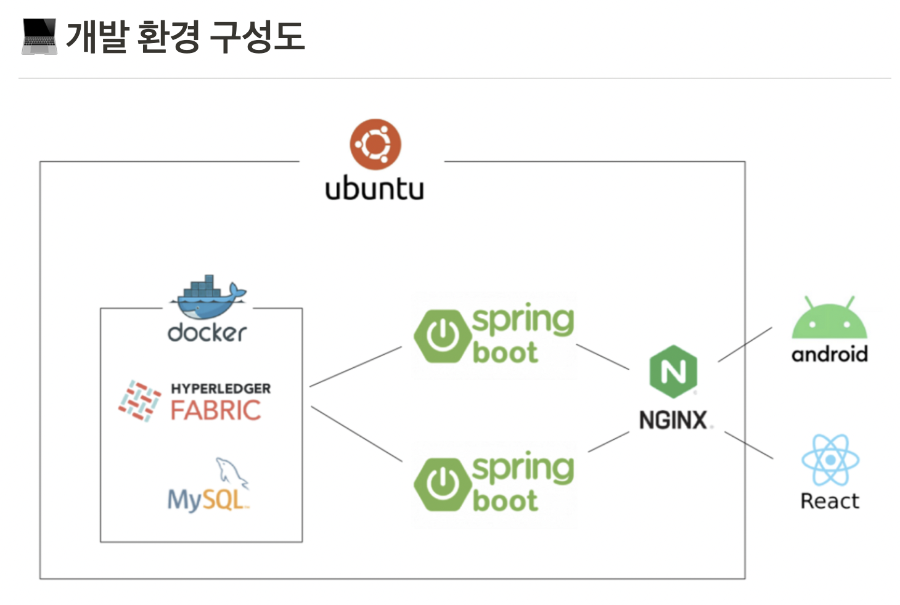

# 한밭대학교 컴퓨터공학과 모블록팀

**팀 구성**
- 20171599 정재엽 
- 20171601 최영창
- 20171616 안규보

## <u>Teamate</u> Project Background
- ### 필요성
  - 블록체인의 보안성과 투명성을 활용하여 실사용이 가능한 가상화폐를 만들고자 한다.
  - 기존의 실물화폐(식권, 투표용지)를 디지털화 하여 관리하기 용이하도록 하고자 한다.

- ### 기존 해결책의 문제점
  - 기존의 코인은 화폐의 가치가 일정하지 못해서 실사용에 문제가 있다.
  - 관리자가 손쉽게 가상화폐 발급이 불가능하다.
  - public 블록체인의 코인들은 즉각적인 반영이 되지 않는다는 문제가 있다.
  
## System Design

    
## Conclusion
  - 관리자가 손쉽게 용도별로 가상화폐를 생성 및 관리가 가능하다.
  - 사용자는 발급된 가상화폐를 안드로이드 어플리케이션을 통해 손쉽게 거래가 가능하다.
  - 투표나 소규모 행사에서 통용되는 화폐 시스템으로 사용 할 경우 투명성을 보장할 수 있을 것으로 기대된다.
  
## Project Outcome
- 2022년 추계종합학술발표회 참가
- 2022년 공개 SW개발자 대회 참가

## Poster

